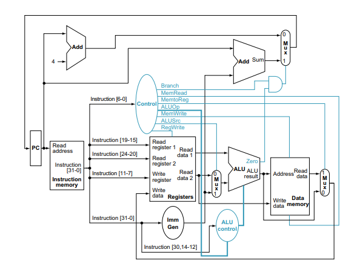
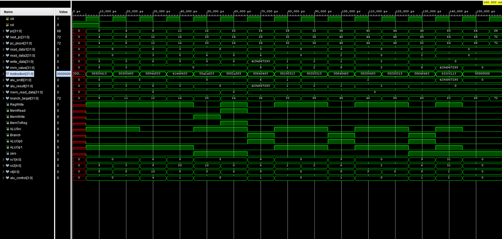
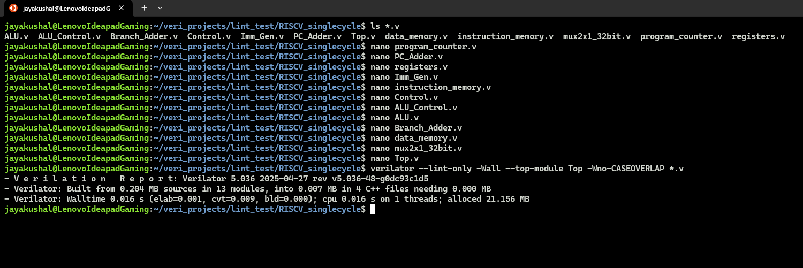

# Single-Cycle-RISC-V-Processor-RV32I
[](https://www.veripool.org/verilator/)

A Verilog implementation of a single-cycle RISC-V processor supporting the RV32I base instruction set.

## Overview

This project is the result of my independent exploration into computer architecture and digital design. I built this single-cycle RISC-V processor (RV32I) entirely by myself as a hands-on way to learn and practice Verilog, digital systems, and the RISC-V ISA.
To ensure my code was not only functional but also met industry standards for style and reliability, I used Verilator for rigorous linting and static analysis. This helped me catch subtle mistakes, improve code quality, and gain experience with professional hardware development tools.

For a detailed Verilator download and installation guide, check out my companion repository: [Verilator-Linting-guide](https://github.com/JayaKushal24/Verilator-Linting-guide)


**Note  :** This project was developed independently as part of my learning journey in computer architecture and digital design.

## Directory Structure
```
├── Code_AfterLinting_verilator/         # Verilator-linted Verilog modules
├── Standard Architecture Code/          # My Verilog implementation of standard Architecture
├── RISCV_Architecture.png               # Processor architecture diagram
├── RV32I Base Instruction Set.png       # Supported instruction set reference
├── ALU_Control ALUop.png                # ALU control logic diagram
└── README.md                            # This file
```
## Architecture

The processor follows the standard single-cycle RISC-V architecture with separate instruction and data memories:



### Core Modules

- **Top.v** - Top-level module that interconnects all processor components
- **program_counter.v** - Program Counter that holds the address of the current instruction
- **instruction_memory.v** - Instruction memory that stores the program instructions
- **registers.v** - 32-entry register file with dual read ports and single write port
- **ALU.v** - Arithmetic Logic Unit that performs computational operations
- **ALU_Control.v** - ALU control unit that generates ALU operation signals based on instruction type
- **Control.v** - Main control unit that generates control signals from instruction opcodes
- **Imm_Gen.v** - Immediate generator that extracts and sign-extends immediate values
- **data_memory.v** - Data memory for load and store operations
- **mux2x1_32bit.v** - 32-bit 2-to-1 multiplexer for data path selection
- **PC_Adder.v** - Adder for calculating PC+4 (next sequential instruction)
- **Branch_Adder.v** - Adder for calculating branch target addresses


## Features
- Single-cycle execution model
- Modular Verilog design for clarity and maintainability
- Verilator-compatible and lint-clean codebase
- Educational-focused implementation with clear module separation
  
## Functional Verification

The processor design was functionally verified using a Verilog testbench. The testbench instantiates the processor as the Design Under Test (DUT), generates clock and reset signals, and applies instruction sequences to verify correct execution.

Below is a sample waveform generated during simulation, demonstrating correct processor operation:




## Linting and Static Analysis with Verilator

After functional simulation, all Verilog modules were linted using Verilator to ensure code quality, style compliance, and synthesizability.
Linting checks for syntax errors, potential bugs, and best-practice violations, helping ensure the design is robust and portable.

Below is a screenshot showing the final successful linting stage:




